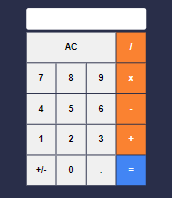

<h1 align="center">
    Calculadora React
</h1>

    <a href="#-sobre">Sobre</a>&nbsp;&nbsp;&nbsp;|&nbsp;&nbsp;&nbsp;
    <a href="#-pré-requisitos">Pré-requisitos</a>&nbsp;&nbsp;&nbsp;|&nbsp;&nbsp;&nbsp;
    <a href="#-instalação">Instalação</a>&nbsp;&nbsp;&nbsp;|&nbsp;&nbsp;&nbsp;
    <a href="#-autor">Autor</a>

## 📋 Sobre
Projeto desenvolvido com a intenção de praticar os conceitos básicos de Class Component, Props e State em React
## ⚙️Pré-requisitos
- [Git](https://git-scm.com)
- [Node.js](https://nodejs.org/en/)

## 👨🏾‍💻 Instalação
- Clone o repositório usando o comando git clone <https://github.com/felipelalmeida/calculadora-react.git>
- Acesse a pasta do projeto em seu terminal: cd calculadora-react
- Instale as dependências: npm install
- Para iniciar o projeto execute: npm start
- A aplicação abrirá na porta:3000 - <http://localhost:3000/>

## ✍ Autor

Felipe Almeida